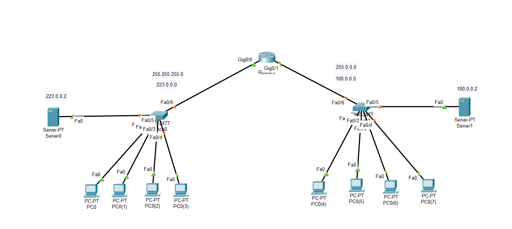
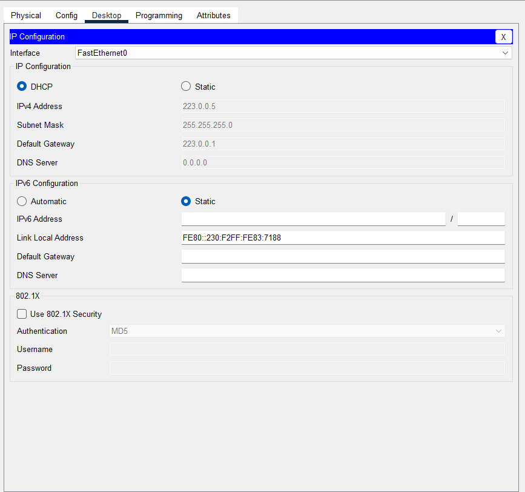
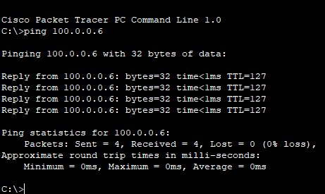

# Cisco Packet Tracer - DHCP Configuration Lab

## Overview

This project demonstrates how to configure a Cisco router as a DHCP server for two different networks using Cisco Packet Tracer.

The router automatically assigns IP addresses to clients connected to each LAN.

---

## Objectives

- Configure router interfaces
- Configure multiple DHCP pools
- Automatically assign IP addresses
- Configure default gateways
- Verify DHCP functionality
- Test network connectivity

---

## Network Topology

> Add a screenshot named **topology.png** inside the `screenshots` folder.



---

## Devices Used

| Device            | Quantity |
| ----------------- | -------: |
| Cisco 2911 Router |        1 |
| Cisco Switch      |        2 |
| PCs               | Multiple |

---

## Network Information

| Network      | Gateway   | DHCP Pool |
| ------------ | --------- | --------- |
| 223.0.0.0/24 | 223.0.0.1 | net1      |
| 100.0.0.0/8  | 100.0.0.1 | net2      |

---

## Router Interfaces

| Interface          | IP Address   |
| ------------------ | ------------ |
| GigabitEthernet0/0 | 223.0.0.1/24 |
| GigabitEthernet0/1 | 100.0.0.1/8  |

---

## DHCP Configuration

### Pool net1

```bash
ip dhcp pool net1
 network 223.0.0.0 255.255.255.0
 default-router 223.0.0.1
```

### Pool net2

```bash
ip dhcp pool net2
 network 100.0.0.0 255.0.0.0
 default-router 100.0.0.1
```

---

## Verification

### Client received an IP address

Add a screenshot:



---

### Second network DHCP


---

### Ping Test



---

## Project Files

```
DHCP.pkt
configs/R1.txt
README.md
```

---

## Skills Demonstrated

- Cisco IOS
- DHCP Configuration
- IPv4 Addressing
- Router Configuration
- LAN Configuration
- Network Verification
- Cisco Packet Tracer

---

## Author

Tarik Hamraoui
