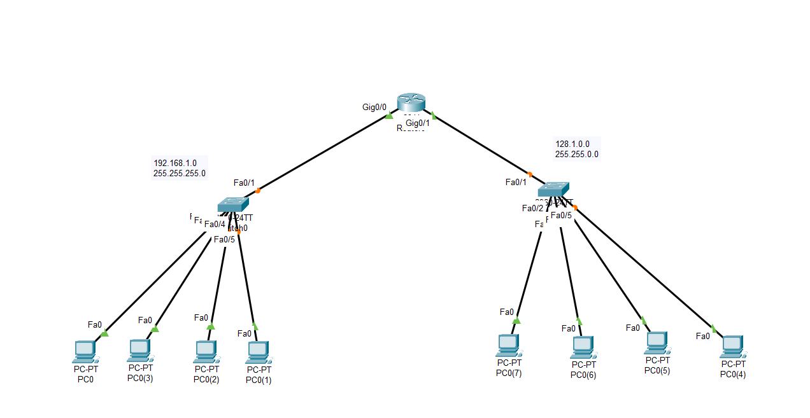
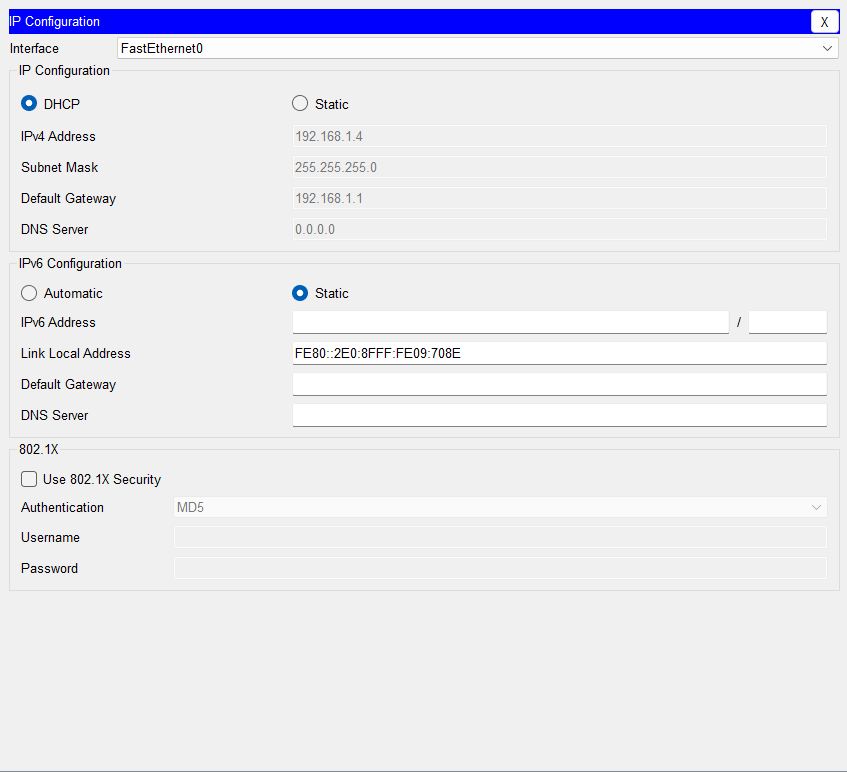
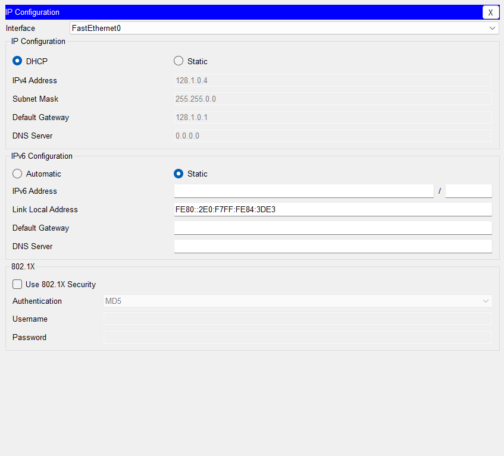
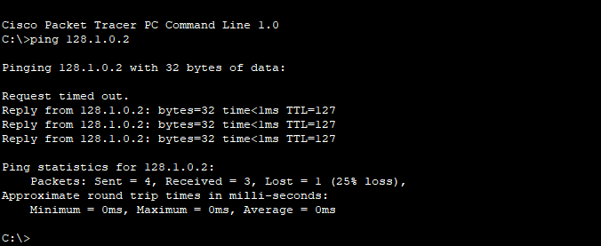

# Cisco Packet Tracer - DHCP Configuration Lab

## 📖 Overview

This project demonstrates how to configure a Cisco 2911 router as a DHCP server using Cisco Packet Tracer. The router provides automatic IP address assignment to clients on two different networks through separate DHCP pools.

This lab is designed for CCNA students and anyone learning Cisco networking fundamentals.

---

## 🎯 Objectives

- Configure router interfaces with IPv4 addresses.
- Configure multiple DHCP pools.
- Automatically assign IP addresses to client devices.
- Configure default gateways for each network.
- Verify DHCP functionality.
- Test connectivity between devices.

---

## 🛠️ Technologies Used

- Cisco Packet Tracer
- Cisco IOS
- DHCP (Dynamic Host Configuration Protocol)
- IPv4 Addressing

---

## 🖥️ Devices

- 1 × Cisco 2911 Router
- 2 × Cisco Switches
- Multiple PCs

---

## 🌐 Network Topology

> Add your topology screenshot to the `screenshots` folder and rename it `topology.png`.

```text
                +----------------+
                |    Router      |
                +----------------+
                | G0/0 | G0/1    |
                +---+------+-----+
                    |      |
              +-----+      +-----+
              |                  |
          Switch 1           Switch 2
              |                  |
        DHCP Clients       DHCP Clients
```

---

## 📡 IP Addressing

| Interface          | IP Address  | Subnet Mask   |
| ------------------ | ----------- | ------------- |
| GigabitEthernet0/0 | 192.168.1.1 | 255.255.255.0 |
| GigabitEthernet0/1 | 128.1.0.1   | 255.255.0.0   |

---

## 📋 DHCP Configuration

### DHCP Pool 1

```bash
ip dhcp pool net1
 network 192.168.1.0 255.255.255.0
 default-router 192.168.1.1
```

### DHCP Pool 2

```bash
ip dhcp pool net2
 network 128.1.0.0 255.255.0.0
 default-router 128.1.0.1
```

---

## 📁 Project Structure

```
DHCP-Lab/
│
├── DHCP.pkt
├── README.md
├── configs/
│   └── Router.txt
└── screenshots/
    ├── topology.png
    ├── dhcp-net1.png
    ├── dhcp-net2.png
    └── ping-test.png
```

---

## ✅ Verification

Verify the following:

- Clients receive IP addresses automatically.
- Default gateway is assigned correctly.
- Clients can ping the router.
- Clients can communicate within their respective networks.

Example commands:

```bash
ipconfig
```

```bash
ping 192.168.1.1
```

```bash
ping 128.1.0.1
```

---

## 📸 Screenshots

### Network Topology



### DHCP Assignment - Network 1



### DHCP Assignment - Network 2



### Connectivity Test



---

## 📚 Skills Demonstrated

- Cisco Router Configuration
- DHCP Server Configuration
- IPv4 Addressing
- Cisco IOS CLI
- Network Verification
- Basic Network Troubleshooting

---

## 🚀 How to Run

1. Open `DHCP.pkt` in Cisco Packet Tracer.
2. Start Simulation or Realtime mode.
3. Open a PC.
4. Navigate to **Desktop → IP Configuration**.
5. Select **DHCP**.
6. Verify that an IP address is assigned automatically.
7. Open **Command Prompt** and test connectivity using the `ping` command.

---

## 👨‍💻 Author

**Tarik Hamraoui**

Feel free to explore the project, suggest improvements, or use it for learning purposes.

---

## ⭐ If you found this project helpful, consider giving it a star!
